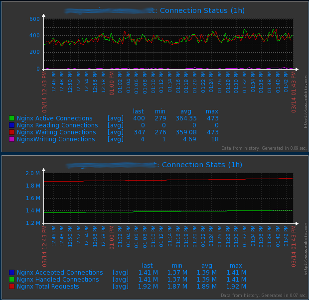

nginx-zabbix-template
=====================

Description
-----------

This is a minimal template to get info from your NGINX server from two places. Via zabbix-agentd in clients or via externalscripts in zabbix server. Choose your option.

Monitoring information by now:

* active
* accepted
* handled
* requests
* reading
* writting
* waiting

NGINX Config
------------

Try to add this lines:

```
  location =/nginx_status/ {
        # Turn on nginx stats
        stub_status on;
        # I do not need logs for stats
        access_log   off;
        # Security: Only allow access from IP #
        allow zabbix_server;
        # Send rest of the world to /dev/null #
        deny all;
    }

```

Being zabbix_server the hostname or the IP address of your zabbix server or localhost if it is installed in zabbix_agent.

Choose ONE of the installation options below

Installation in the Zabbix Server
---------------------------------

You should look for the external scripts directory in your Zabbix Server configuration file. 
In the CentOS 6.4 RPM Zabbix installation is: 

``` 
 /usr/lib/zabbix/externalscripts 
```

Copy the python script there. A chmod/chown to get execution permission is necessary.

Now, in your Zabbix frontend: Configuration-Templates section, Import bottom in the right.

Choose the XML file (for server installation: zbx_nginx_template.xml) and import it.

Apply this new template to your NGINX servers. 

You don't need to modify the template if you are using the standard port to access to the NGINX (port 80).

It permits a fast configuration because of you can apply the same template to all your NGINX servers without modification/installation in the agents.

Installation on a Zabbix Client
-------------------------------

CentOS

Copy getNginxInfo.py to /usr/local/sbin/ - You need to edit zabbix-nginx.conf if you use a different location

Copy zabbix-nginx.conf to /etc/zabbix/zabbix_agentd.d/ - zabbix-nginx.conf must be updated if you want to use a different port than port 80

Restart the zabbix-agent

Import zbx_nginx_agent_template.xml in your Zabbix frontend : Configuration-Templates section, Import button top  right.

-----------
Environment
-----------

I am using this script in my production environment:

* Nginx 1.4.5+
* Zabbix 2.2.x

Screenshots
-----------


